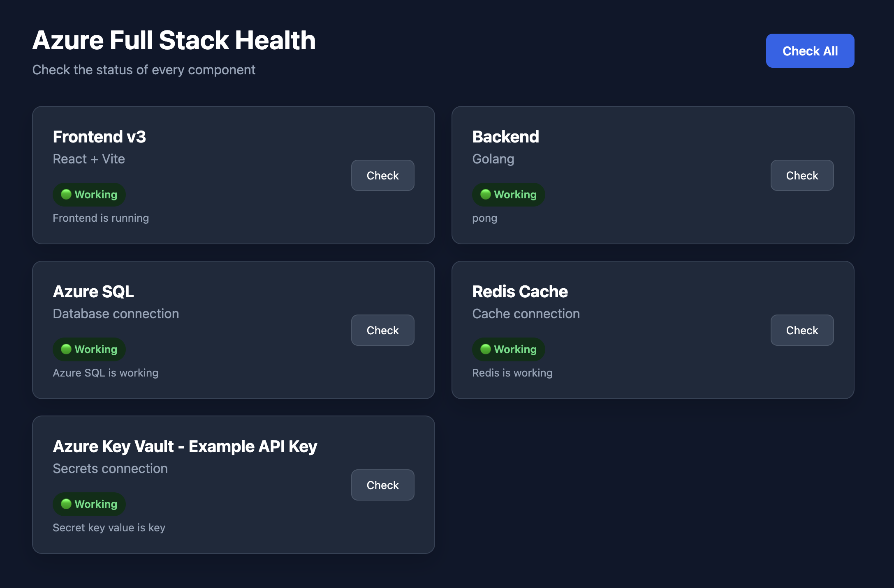
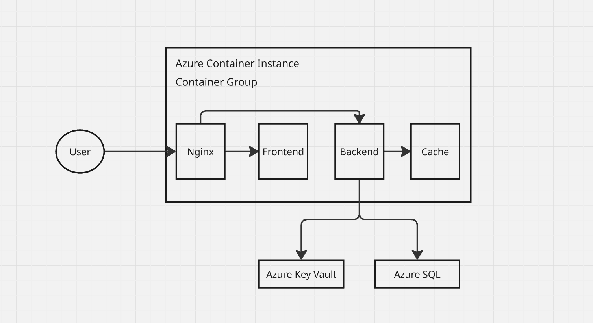
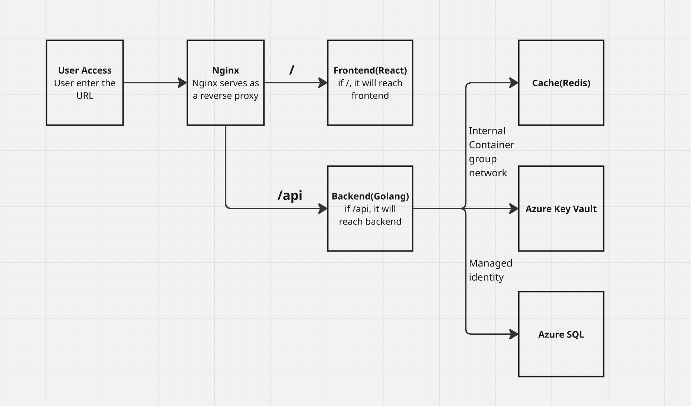

# Final Project - Azure Full Stack Health



Full-Stack Applicaiton with **React**, **Go**, **Docker** and **Azure**

After studying for the Microsoft AZ-900: Azure Fundamentals certification, I would like to make a final project to apply what I learned by building and deploying a full-stack application using Azure.

The goal of this project is to demonstrate fundamental Azure concepts, including containerization, cloud resources, identity management, secrets manageemnt, database, and CI/CD.

There are areas of the application that cound be improved but I decided to stop at it's current state and treat this version as the final project.

In this repo, I will go over deployment stages, errors I troubleshooted and explanation on the steps.

## Final

Once your Frontend, backend, Nginx, Azure Key Vault, and SQL are working, Frontend will show you everything is working.

## Tech stacks

- Frontend: React
- Backend: Go (Golang)
- Cache: Redis
- Web Server / Reverse Proxy: Nginx
- Cloud Platofrm: Microsoft Azure
- Containerization: Docker



## Azure Technologies

The project utilizes the following Azure services and concepts

- **Azure SQL Database** - Relational database for application data
- **Azure Key Vault** - Secure storage and management of secrets
- **Azure Container Instances** - Hosting and running application containers
- **Azure Container Registry** - Storing and managing Docker container images
- **Managed Identity** - Providing Azure resources with secure access to other Azure services without storing credentials in the application

## Deployment

The application is containerized using Docker and deployed to Azure Container Instances (ACI).

GitHub Actions is used to automate the CI/CD process, including building Docker images, pushing images to Azure Container Registry (ACR), and deploying the application to Azure Container Instances.

## Work Flow



Each service in the application has its own Dockerfile located in its respective directory. The application consists of the following services:

**Nginx** – Serves the frontend and acts as a reverse proxy for API requests.
**Frontend** – Provides the web user interface.
**Backend** – A Go application that handles the application's business logic and API requests.
**Redis** – Used for caching and data storage by the backend.

### Docker compose

Docker Compose is used during development to build and run the application's services together.

One issue I encountered during deployment was a platform/architecture mismatch. My development environment is a Mac, while the Azure environment uses the linux/amd64 architecture.

To avoid compatibility issues, the services are built for the linux/amd64 platform:

`platform: linux/amd64`

This ensures that the Docker images built on the development machine are compatible with the Azure environment.

### azure-aci.yml

Instead of deploying each container individually, the application uses an azure-aci.yml file to define the entire Azure Container Instance container group.

The YAML file defines the containers, images, ports, environment variables, and other configuration required to run the application.

The imageRegistryCredentials section is particularly important because the Docker images are stored in a private Azure Container Registry. ACI uses these credentials to authenticate with ACR and pull the required container images.

Without valid registry credentials, ACI cannot access the private images stored in ACR.

### Github Actions

GitHub Actions is used to automate the application's CI/CD pipeline instead of manually building, pushing, and deploying the containers.

The workflow generally follows these steps:

1. **Detect Changes**
GitHub Actions checks which services have changed, such as the frontend or backend.
2. **Build, Tag and Push Docker Images**
If a service has changed, GitHub Actions builds a new Docker image for that service.
The newly built images are tagged with the Azure Container Registry address and image name.
The Docker images are pushed to Azure Container Registry (ACR).
3. **Get the Latest Images**
Before deployment, the workflow determines the latest image tags for the required services.
4. **Deploy to ACI**
GitHub Actions uses azure-aci.yml to deploy the application to Azure Container Instances.
5. **Run the Application**
The ACI container group runs the Nginx, frontend, backend, and Redis containers. Nginx receives requests from users and forwards API requests to the backend, while the backend communicates with Redis internally.

### Azure Prerequisites

Before deploying the application containers, we need to prepare several resources and permissions in Azure.

1. **Container a container group**

Create a resource group that will contain the resources used by the application, including:

Azure Container Registry (ACR)
Azure Container Instance (ACI)
Azure Key Vault
Azure SQL Database
Other required Azure resources

2. **Create an Azure Container Registry**

Create an Azure Container Registry (ACR) to store the Docker images used by the application.

When creating the registry, make sure Admin user / access keys are enabled if your ACI deployment uses registry username and password authentication.

The ACR will store images such as:

final-project-nginx
final-project-frontend
final-project-backend
final-project-redis

3. **Assign Permissions to GitHub Actions**

GitHub Actions needs permission to create and manage Azure resources and push Docker images to ACR.

First, get the Resource Group ID:

```
groupId=$(az group show \
  --name <resource-group-name> \
  --query id \
  --output tsv)
```

Create a Service Principal with the Contributor role:

```
az ad sp create-for-rbac \
  --scope $groupId \
  --role Contributor \
  --sdk-auth
```

Copy the credentials returned by this command and store them securely in GitHub Actions Secrets.

Next, get the ACR resource ID:

```
registryId=$(az acr show \
  --name <registry-name> \
  --resource-group <resource-group-name> \
  --query id \
  --output tsv)
```

Give the GitHub Actions Service Principal permission to push images to ACR:

```
az role assignment create \
  --assignee <ClientId> \
  --scope $registryId \
  --role AcrPush
```

This allows GitHub Actions to build Docker images and push them to the Azure Container Registry.

4. **Enable Managed Identity for ACI**

When the Azure Container Instance is deployed, enable a system-assigned managed identity.

This identity allows the container running in ACI to authenticate with Azure services without storing Azure credentials directly inside the application.

For example, the backend can use the managed identity to access secrets stored in Azure Key Vault.

5. **Create Azure key vault**

Create an Azure Key Vault to securely store application secrets and configuration values.

For example:

Database credentials
Redis credentials
Application secrets
Other sensitive configuration values

Before managing secrets or keys in the Key Vault, make sure the appropriate Azure RBAC permissions such as Key Vault Administrator are assigned to your account. Otherwise, you won't be able to add secrets.

The ACI system-assigned managed identity should also be granted the appropriate role, such as Key Vault Secrets User, so the application can read secrets from the vault.

This allows the application to access secrets without hard-coding them into the Docker image or source code.

4. **Create a SQL database**

Create the Azure SQL Database that will be used by the backend application.

After creating the database, create a Microsoft Entra-based database user for the container identity:

`CREATE USER [your-container-name] FROM EXTERNAL PROVIDER;`

Then grant the user read permissions:

`ALTER ROLE db_datareader ADD MEMBER [your-container-name];`

The square brackets [] are important.

Make sure the Azure SQL networking/firewall configuration allows the required Azure services or application traffic to connect to the database.

## A few questions to consider

1. **Why Azure SQL?** <br>
We would like to manage as little as possible. That's why we choose Azure SQL.

2. **Why not Azure Redis Cache?** <br>
For this testing, it's expensive in my opinion. But if it's production, I would choose Azure Redis Cache.

3. **Why not Azure Container Apps?** <br>
I tried to use it for the testing but I felt like it was overkill. In addition, it takes so long to create one environment.

4. **Why choose Azure Container Registry?** <br>
Docker introduced the pull limit and it is effecting the testing. That's why I chose ACR.

5. **Why not VM?** <br>
Like previously mentioned, we would like to manage as little as possible. Also, getting a VM is a bit expensive and hard to get cheap one.

6. **Improvement?** <br>
It will be better if we automate the azure deployment such as container group, key vault, managed identity, and Database. 
